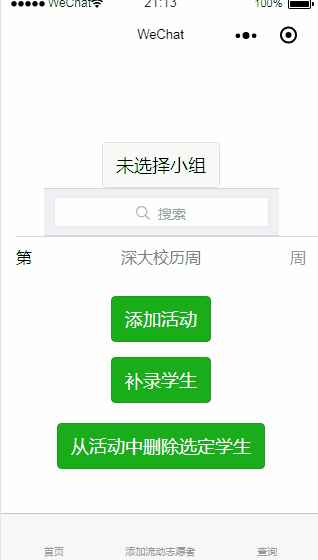
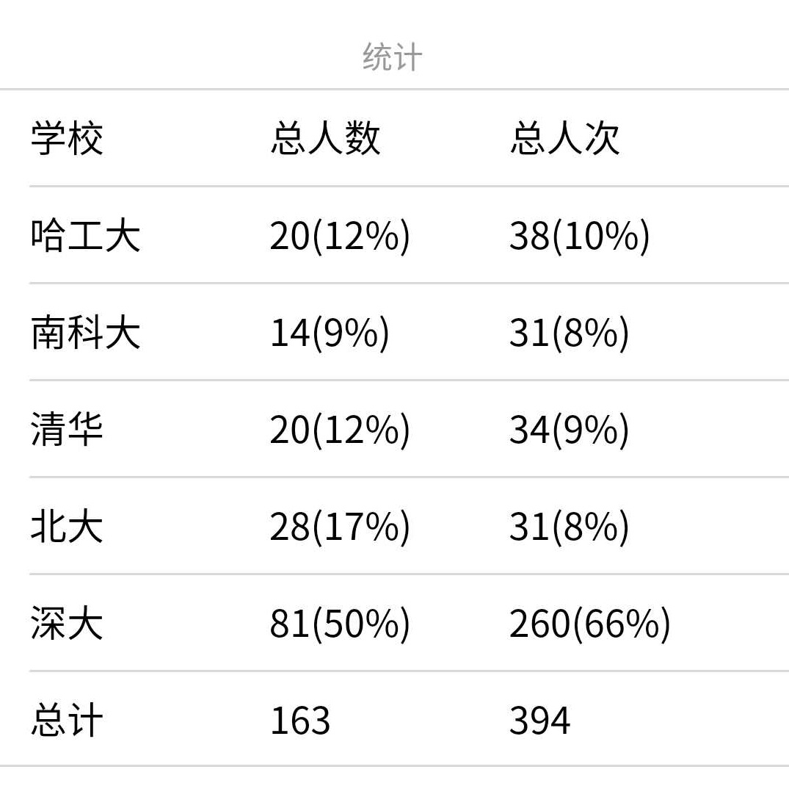

[](https://travis-ci.com/zhaofeng-shu33/xingyu)
# 介绍


## 开发背景
星语志愿项目是大学生关爱自闭症儿童的志愿服务项目，希望通过小程序更方便组织人员统计志愿者的信息。更具体地说，是深圳市距离较近的五所高校团委下属的志愿组织（义工联）相互合作，统一志愿者招募和管理等方面的信息化工具。相关推送可参考：

* [星路有你，一起同行](https://mp.weixin.qq.com/s/byIknsUz62tn1YJlp10byQ)
* [星语再出发|新学期活动预告](https://mp.weixin.qq.com/s/hSAWZha7Tkq2MzG_uOD06Q)
* [星语 | 星之后裔，伴以情语](https://mp.weixin.qq.com/s/VM50R464I1mo3E6GOoEZew)
* [活动进行时 | 为星儿点灯](https://mp.weixin.qq.com/s/RyINo_CrGJZAUaHekhHcPg)

由于参与活动的学生比较多，且来自不同的学校，在不同的时间前往不同的机构，信息比较琐碎。各校的项目负责人需要统计自己所在的学校参与活动的同学与活动基本信息，以便完成各自学校的交通报销与志愿工时的录入等。传统的组织管理方法通常需要在电脑上用Excel进行操作，文件共享不够及时，跨校信息整合多有不便。星语志愿项目微信小程序开发的初衷即是
解决各校在星语志愿项目上信息不对称的问题，提供自项目开展以来的实时数据信息。

## 应用场景

截至目前，星语志愿项目微信小程序为各校志愿活动组织者内部效率工具。

* 针对每次活动带队的小组长，提供录入参与活动的各校志愿者信息等功能；
* 针对小组长和各校的志愿项目负责人，提供查看录入的数据、导出Excel等功能。

## 技术开发方案

一个完整的小程序由前端和后端组成，星语志愿项目微信小程序前后端均采用原生开发的方式，其中后端是PHP原生开发，连接的是 mysql 数据库进行持久化存储。

## 团队组成与分工

星语志愿项目微信小程序主要由 [赵丰](https://github.com/zhaofeng-shu33) 进行开发；此外，部分小组长和志愿项目负责人提出了一些新的功能需求。

## 前端配置
出于安全性考虑本项目使用了 appsecret 及微信登录的功能，只有授权的志愿者（小组长）才能发起 POST 请求成功，GET 请求则不受此限制。

目前的权限管理思路大致为：当一个匿名用户发起录入数据的请求时，星语志愿项目微信小程序需要调用`wx.getUserInfo` 获取该用户的昵称并和后端提前存好的昵称进行匹配，如果匹配成功则该用户有操作权限，之后每一次POST请求均通过 `openid` 的令牌进行校验；如果匹配失败用户没有操作权限，但不会在后端留有普通用户的个人信息，以保证用户的隐私。

使用了 [weui-wxss](https://github.com/Tencent/weui-wxss) 库，但未包含在项目里，需从 GitHub 上下载。
工作目录切到 `mini-program`后使用：
```shell
svn checkout https://github.com/Tencent/weui-wxss/trunk/dist/style style
```
下载 GitHub 仓库子目录

## 后端配置
可使用本地的后端进行开发。

将 `mysql-sample.php` 改为 `mysql.php`，并相应地配置里面的信息。

## 接口文档
见 [doc](doc/doc.md)。

## 贡献指南 (Contributing Guild)
See [contributing](doc/contributing.md)

# CHANGELOG
版本以小程序的线上版本为准，即为审核通过后发布的时间。

## v0.3 (3月26日)
线上第一版，实现了小组长选择所在的小组，添加流动志愿者录入信息，查看录入的结果三大功能。对应 [doc](doc/doc.md) 的前6个后端api（后面有完善）。

## v0.5 (3月27日)
针对有的小组长对于某个录入志愿者有遗漏的问题，增加补录志愿者的功能
 
## v0.6 (3月29日)
增加特色活动的列表和详情的展示页面

## v0.7 (3月29日)
针对有的小组长录错志愿者的问题，增加从活动中删除选定学生的功能

## v0.8 (4月1日)
* 数据库支持2018秋季学期志愿者录入
* 后端部分支持拿到2018秋季学期数据
* 因为2019春季学期有的固定志愿者调整了固定服务时间，前端增加改变固定志愿者的组别的功能

## v0.9 (4月2日)
增加动态统计各校志愿者的功能，下图是4月14日的结果：


## v1.0 (4月15日)
针对小组长录错流动志愿者姓名的问题增加删除流动志愿者的功能

## v1.1 (4月16日)
针对有的固定志愿者会报名其他时间的流动岗位的问题完善调整志愿者组别的功能，原来是可以把一个固定志愿者由一个组改为另一个组，现在取消了这个功能(v0.8增加)，设置成为对于增加志愿者的组和删除志愿者的组两个功能。

## v1.2 (5月15日)
增加导出本学期某学校志愿信息的功能。

## v1.3.4 (5月26日）
增加权限功能，只有小组长可以录入数据，普通用户可以查看结果。

## v1.4 （6月1日）
* 增加机构统计信息、下载excel的功能；
* 界面布局调整

## v1.5 （6月3日）
增加常规活动跨学期查询的功能

## v1.6 （6月4日）
增加简单的数据可视化的功能

## v1.7 (9月18日）
* 增加对小组长跨学期操作的支持
* 调整修改志愿者组别的 API 接口
