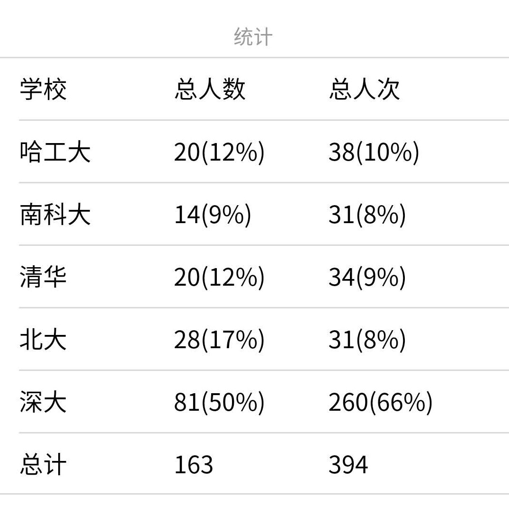

# 介绍

## 前端配置
出于安全性考虑本项目使用了 appsecret 及微信登录的功能，只有授权的志愿者才能发起 POST 请求成功，GET 请求则不受此限制。

使用了 [weui-wxss](https://github.com/Tencent/weui-wxss) 库，但未包含在项目里，需从 GitHub 上下载。
工作目录切到 `mini-program`后使用：
```shell
svn checkout https://github.com/Tencent/weui-wxss/trunk/dist/style style
```
下载 GitHub 仓库子目录

## 后端配置
可使用本地的后端进行开发。

将 `mysql-sample.php` 改为 `mysql.php`

## 接口文档
见 [doc](doc.md)

# CHANGELOG
版本以小程序的线上版本为准

## v0.3 (3月26日)
线上第一版，实现了小组长选择所在的小组，添加流动志愿者录入信息，查看录入的结果三大功能。对应 [doc](doc.md) 的前6个后端api（后面有完善）。

## v0.5 (3月27日)
针对有的小组长对于某个录入志愿者有遗漏的问题，增加补录志愿者的功能
 
## v0.6 (3月29日)
增加特色活动的列表和详情的展示页面

## v0.7 (3月29日)
针对有的小组长录错志愿者的问题，增加从活动中删除选定学生的功能

## v0.8 (4月1日)
* 数据库支持2018秋季学期志愿者录入
* 后端部分支持拿到2018秋季学期数据
* 因为2019春季学期有的固定志愿者调整了固定服务时间，前端增加改变固定志愿者的组别的功能

## v0.9 (4月2日)
增加动态统计各校志愿者的功能，下图是4月14日的结果：


## v1.0 (4月15日)
针对小组长录错流动志愿者姓名的问题增加删除流动志愿者的功能

## v1.1 (4月16日)
针对有的固定志愿者会报名其他时间的流动岗位的问题完善调整志愿者组别的功能，原来是可以把一个固定志愿者由一个组改为另一个组，现在取消了这个功能(v0.8增加)，设置成为对于增加志愿者的组和删除志愿者的组两个功能。

## v1.2 (5月15日)
增加导出本学期某学校志愿信息的功能。
